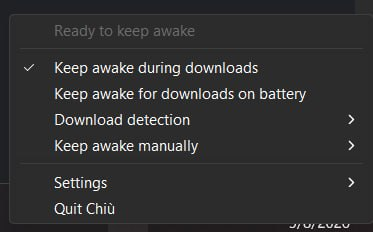
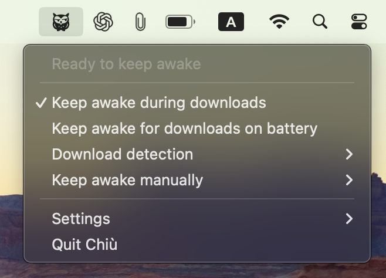

# Chiù

> **Image placeholder:** Chiù app icon.

**Keep your computer awake during downloads — or whenever you tell it to.**

Chiù is a small Windows tray and macOS menu-bar utility that prevents idle
system sleep while protection is active. It can react to sustained download
activity or keep the computer awake for a period you choose. It does not keep
the display awake, override an explicit sleep command, or change normal
lid-close behavior.

## Supported platforms

- Windows 11 x64
- macOS 14 or later, with Intel and Apple Silicon support in one universal
  package

Linux is not supported.

## Screenshots

### Windows

  

### macOS

  

## How it works

### During downloads

`Keep awake during downloads` watches aggregate incoming network activity on
the computer. Sustained activity must qualify before Chiù requests sleep
protection, and a grace period avoids releasing protection immediately during a
short quiet interval.

Chiù does not inspect packets, identify applications, or know which file is
being downloaded. Network activity can therefore produce both false positives
and false negatives. See [Automatic download detection](docs/automatic-detection.md)
for details and tuning options.

Automatic protection is enabled by default on external power. On battery or
another limited/unknown power source, it is eligible only when `Keep awake for
downloads on battery` is enabled. This setting does not restrict manual
keep-awake sessions.

### On demand

`Keep awake manually` starts protection for 15 or 30 minutes; 1, 2, 4, or 8
hours; or until disabled. Time added to a finite session extends its existing
deadline. Manual sessions end when Chiù exits and are not restored on restart.

Automatic and manual reasons can overlap. Chiù keeps the native sleep request
active until every reason has ended, and reports a failure rather than claiming
to keep the computer awake when the operating system request was not acquired.

The tray also provides download-detection tuning and a `Settings` submenu for
launch at login, optional updates, diagnostics, logs, and application details.
[How Chiù works](docs/how-it-works.md) explains the full behavior.

## Download and installation

Published downloads and release notes appear on
[GitHub Releases](https://github.com/Ma1kovich/chiu/releases). On macOS, mount
the disk image, drag `Chiù.app` to its `Applications` shortcut, then eject the
disk image.

On macOS, the first launch may require one approval through **System Settings →
Privacy & Security → Open Anyway**. Never disable Gatekeeper to install Chiù.
See [Apple's safety guidance](https://support.apple.com/en-gb/102445) and
[Releasing](docs/releasing.md) for details.

## Privacy

Download detection stays local and uses aggregate received-byte counters. Chiù
has no telemetry, analytics identifier, crash-reporting service, or
automatic diagnostic upload. Local logs are bounded, and a diagnostic snapshot
is created and copied only when you choose `Copy diagnostics`.

A configured update checker can contact its release endpoint. Update checking
is not telemetry and does not upload diagnostics or activity history. Read the
concrete data flows in [Privacy](docs/privacy.md).

## Important limitations

- Network activity alone cannot prove that a particular application or file is
  downloading.
- On Windows Modern Standby systems, ordinary application power requests may
  block sleep indefinitely on AC power but for only up to five minutes on
  battery after the configured sleep timeout. `Keep awake for downloads on
  battery` therefore cannot guarantee indefinite wakefulness on affected
  hardware. See [Microsoft's Modern Standby guidance](https://learn.microsoft.com/en-us/windows-hardware/design/device-experiences/prepare-software-for-modern-standby).
- Explicit sleep commands and lid-close behavior remain under operating-system
  control.

For safe remedies and evidence collection, see
[Troubleshooting](docs/troubleshooting.md).

## Documentation

- [How Chiù works](docs/how-it-works.md)
- [Automatic download detection](docs/automatic-detection.md)
- [Troubleshooting](docs/troubleshooting.md)
- [Privacy](docs/privacy.md)
- [Architecture](docs/architecture.md)
- [Testing](docs/testing.md)
- [Releasing](docs/releasing.md)

## Why Chiù?

Chiù (pronounced like English *cue*, `/kju/`) is a Tuscan name for the
[Eurasian Scops-Owl (*Otus scops*)](https://science.ebird.org/en/status-and-trends/species/eursco1/range-map). The
name is [onomatopoeic](https://www.treccani.it/vocabolario/chiu/): it imitates
the owl's repeated nighttime call. Like its namesake, Chiù is a small nocturnal
presence that quietly stays awake in the background while work continues.

The product name is written **Chiù**, with a hard `k` sound and the grave
accent. Technical identifiers use the ASCII form `chiu`.

## Contributing, security, and license

- [Contributing](CONTRIBUTING.md)
- [Security policy](SECURITY.md)
- [MIT license](LICENSE)
